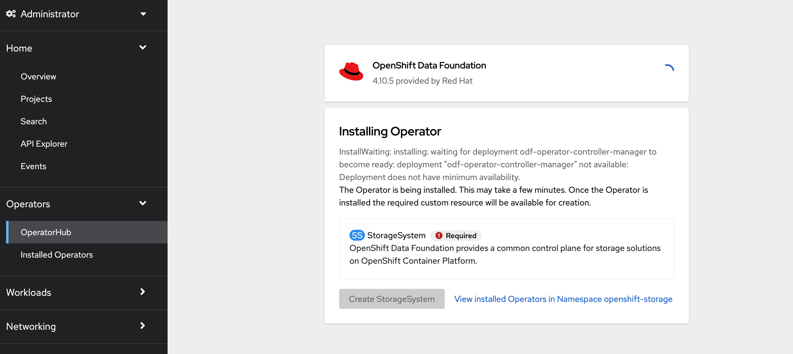
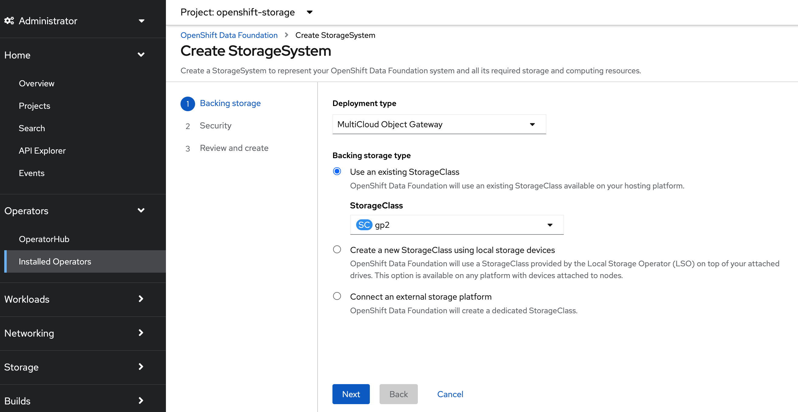
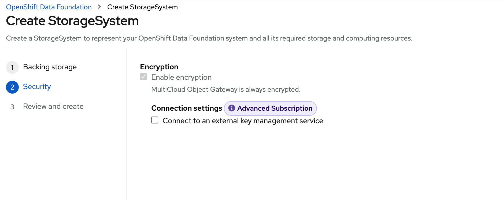
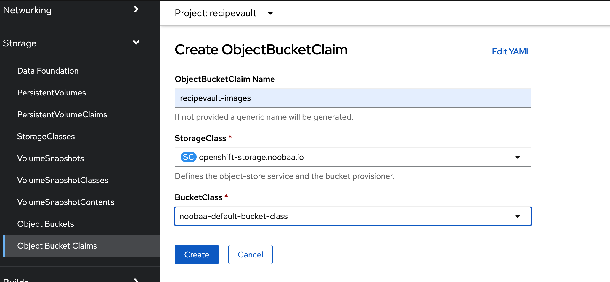
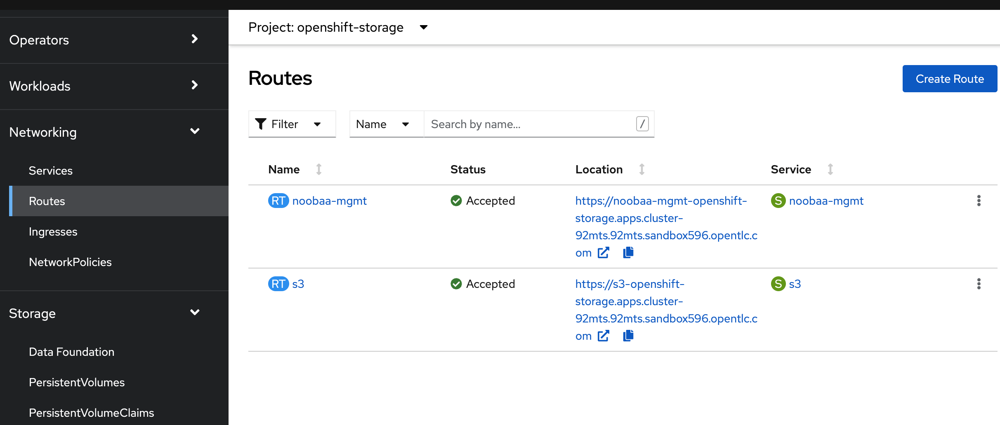
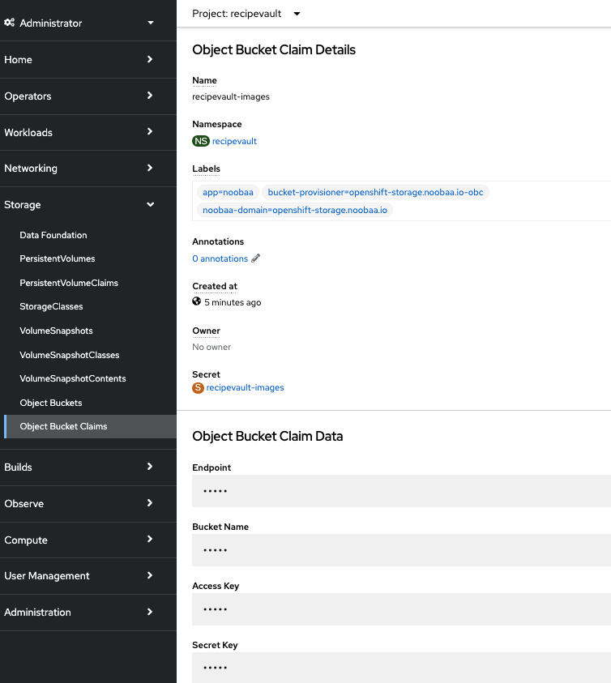

# OpenShift Data Foundation

This requires OCP 4.10.x and ODF 4.10.x

I'm working on automating the deployment but for the initially deployment, here is how to only deploy and use the Multi-Cloud Gateway (S3) capabilities of ODF.

These were all performed as Cluster Admin

## Deploy ODF Operator



## Create the MultiCloud Object Storage Storage System



And on AWS StorageClass gp2 

## Accept Security Defaults



Review and Create. 

Sometimes you will receive an 'Error' 404: Page Not Found.  Just refresh.


## Create Object Bucket Claim in recipevault project

Make sure you are in the 'recipevault' project



This will generate the Bucket and the credential details we need for the app

### Obtain the S3 Route Endpoint - We need the external route because the UI reads directly from the bucket



or cli

`oc get route s3 -n openshift-storage -o json | jq -r '.spec.host'`

### Obtain the generated bucket name and access keys

From the UI 



or cli

`oc get cm/recipevault-images --output json -n recipevault` 

### Obtain the generated access_key and access_secret - Need to trim the new line % 

From the UI in the Object Claim Details or cli (there is a trailing % that needs to be trimmed)

`oc get secret --output json recipevault-images -n recipevault | jq -r .data.AWS_ACCESS_KEY_ID | base64 --decode`

`oc get secret --output json recipevault-images -n recipevault | jq -r .data.AWS_SECRET_ACCESS_KEY | base64 --decode`

## Apply PublicReadGetObject Policy to Bucket

I was able to use s3cmd with http and avoid the Self-Signed Cert issue with aws s3 cli and ODF - https://github.com/s3tools/s3cmd 

### s3cmd interactive Configuration to apply policy - Working on simple command line
`s3cmd --configure`

- S3 Endpoint (Don't include protocol prefix): s3-openshift-storage.apps.ocp.webwim.com

- DNS-style bucket+hostname:port template for accessing a bucket: s3-openshift-storage.apps.ocp.webwim.com/%(bucket)

Due to Self-Signed-Cert issue, I did not use HTTPS
- Use HTTPS protocol: False

### Review Config
```Access Key: <YOUR ACCESS KEY>
  Secret Key: <YOUR SECRET>
  Default Region: US (doesn't really matter for ODF)
  S3 Endpoint: <YOUR ENDPOINT)
  DNS-style bucket+hostname:port template for accessing a bucket: <YOUR_S3_ENDPOINT>/%(bucket)
  ```

### Modify Bucket Policy to Anonymous Read - Then the recipe images can be served from S3.

Get your bucket name
`oc get cm --output json recipevault-images -n recipevault | jq -r .data.BUCKET_NAME`

Update [Public JSON ACL file] sample file (../deploy/s3_public_s3.json) with your bucket name

Apply the policy

`s3cmd setpolicy ../deploy/s3/public_s3.json s3://<BUCKET_NAME>`

### Put a test object/image
`s3cmd put ../rest-recipe/src/test/resources/payloads/images/blueberry_kuechen.jpg s3://<BUCKET_NAME>/blueberry.jpg`

`s3cmd put ../rest-recipe/src/test/resources/payloads/images/blueberry_kuechen.jpg s3://recipevault-images-686e5c9e-bb39-4165-b744-c204ac14b3be/blueberry.jpg`

### Validate the URL (better in browser to see the image)
`https://<S3_ROUTE>/<BUCKET_NAME>/blueberry.jpg`

### Delete Object
`s3cmd del s3://<BUCKET_NAME>/blueberry.jpg`

### List Bucket Object
`s3cmd ls s3://<BUCKET_NAME>`


